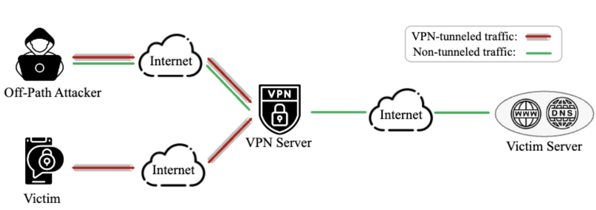
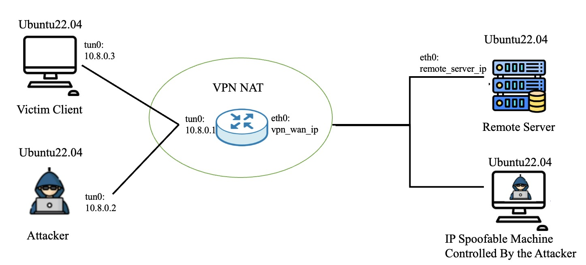

# Invisible Adversaries: A Systematic Study of Session Manipulation Attacks on VPNs

This repository contains the research artifact for our paper accepted to **IEEE INFOCOM 2026**:

**Invisible Adversaries: A Systematic Study of Session Manipulation Attacks on VPNs**

The codebase includes the attack implementations, supporting scripts, and reproduction instructions used in our evaluation of session manipulation attacks on VPN-protected TCP and UDP sessions. In particular, it demonstrates how an off-path attacker sharing the same VPN server as a victim can infer transport-layer state and manipulate an active session under vulnerable deployment conditions.

## Disclaimer and Responsible Use

The materials in this repository are provided to enable reproducibility of our evaluation and to assist researchers in performing defensive testing. Use these materials only for authorized security research and defensive verification on systems you own or have explicit permission to test. As the code in this repository demonstrates real attack techniques against VPN-protected sessions, do not use it to attack third-party systems, accounts, devices, or infrastructure without clear written permission. The authors performed all experiments on systems owned by the project team or used with informed consent. By running these tools, you agree to use them only for defensive research, reproduction of our results, or self-testing in authorized environments.

## Threat Model



Fig. 1. Threat model.

Figure 1 illustrates the threat model of the attacks on VPN-protected sessions, which consists of four types of hosts: a target server, a VPN server, a victim VPN user, and an off-path attacker.

- The target server provides services by accepting requests to an open port and returning responses, such as HTTP services on port 80. Depending on the scenario, the target server can be a popular public service or a self-hosted server.
- The VPN server acts as an intermediate to protect connected users and forwards packets by maintaining a stateful connection tracking table.
- The victim VPN user communicates with the target server through TCP or UDP sessions. In our setting, the client communicates with the server intermittently. For example, it may periodically send TCP requests to a web server or UDP requests to a DNS resolver.
- The physically off-path attacker is a malicious user who also connects to the VPN server and aims to manipulate the sessions of other users. We assume the attacker has sufficient computing and network resources, as well as the ability to perform IP spoofing. The attacker can send normal packets through the VPN tunnel and can also send spoofed packets with the IP address of the target server outside the tunnel.

Attack result: the malicious attacker can deny new TCP or UDP sessions to a chosen remote service, hijack an existing TCP session between another client and the remote server, or inject forged DNS responses into a victim DNS query.

## Environment Setup



Fig. 2. Test environment.

- We verified the attack with three Linux machines running Ubuntu 22.04 rented from Google Cloud: a victim client, a local attacker, and a remote server or spoof server. The endpoints do not have to be Linux, because the vulnerability exists in the VPN server.
- The victim client and the local attacker connect to the same VPN server and share the same public IP address.

  **Note:** You must confirm that they have the same public IP address. For example, if one machine gets `45.67.97.71` and the other gets `45.67.97.14`, the attack will not succeed. You can disconnect the attacker machine from the VPN server and reconnect until both machines obtain the same public IP.

- The attacker also controls an IP-spoofable machine that can send spoofed packets as the remote server.

  **Note:** If you do not have an IP-spoofable machine and still want to verify the attack, you can start another process on the remote server to simulate this role. The local attacker can then connect to that process and request the packets needed for the attack.

- Both the local attacker machine and the IP-spoofable machine, or the remote server when simulating spoofing, need the following software installed:
  - `netcat`
  - `scapy`
  - `libtins` (<http://libtins.github.io/download/>)

```bash
sudo apt install git libpcap-dev libssl-dev cmake build-essential scapy netcat-traditional
git clone https://github.com/mfontanini/libtins.git
cd libtins
mkdir build
cd build
cmake ../ -DLIBTINS_ENABLE_CXX11=1 -DLIBTINS_BUILD_SHARED=ON -DCMAKE_INSTALL_PREFIX=/usr/local
make
sudo make install
sudo ldconfig
```

## Running the Attack Scripts

### Port Exhausting DoS

The repository now includes both TCP and UDP variants of the port exhausting DoS attack. In both cases, the attacker continuously consumes the VPN server's public-facing source ports for a chosen `<remote_server_ip>:<remote_server_port>` pair. The packets use a low TTL so that they can expire before reaching the real remote server while still creating or refreshing entries on the VPN server.

#### TCP Port Exhausting DoS

- On the remote server machine:
  - Open a TCP service for clients to connect to, such as port 80, 443, or 1000.

- On the local attacker machine:
  - `cd local-attacker/TCP-dos`
  - Build the attack script with `make`
  - Update the variables in `attack-dos.sh`
  - Run `sudo bash attack-dos.sh`

- On the victim machine:
  - Try to establish a new TCP connection to `<remote_server_ip>:<remote_server_port>` through the same VPN server. The connection should fail while the attack keeps the TCP source ports occupied.

#### UDP Port Exhausting DoS

- On the remote server machine:
  - Choose a UDP service for the victim to access, such as a DNS resolver on port 53.

- On the local attacker machine:
  - `cd local-attacker/UDP-dos`
  - Build the attack script with `make`
  - Update the variables in `attack-dos.sh`
  - Run `sudo bash attack-dos.sh`

- On the victim machine:
  - Try to create a new UDP session to `<remote_server_ip>:<remote_server_port>` through the same VPN server, for example by issuing a DNS lookup to the targeted resolver. The request should fail while the attack keeps the UDP source ports occupied.

### TCP Hijacking Workflow

The following example uses a `netcat` TCP connection to demonstrate the full TCP hijacking workflow.

- First, on the remote server machine:
  - Open a TCP service for clients to connect to, such as port 80 for HTTP, 21 for FTP, or 22 for SSH.
  - Here we simulate the service with `netcat` on TCP port `1000`. Make sure the firewall allows incoming traffic, then run `sudo nc -lvnvp 1000`.

- Second, on the victim machine:
  - Establish the TCP connection with the remote server. If needed, install `netcat` first with `sudo apt install netcat-traditional`, then run `nc <remote_server_ip> 1000 -p 32800`.
  - You can run `tcpdump` or Wireshark to capture packets and observe the source port, sequence number, and acknowledgment number of the TCP connection.

- Third, on the IP-spoofable machine:
  - **Note:** If you do not have an IP-spoofable machine, you can run the code on the remote server instead. In this case, an additional process on the remote server will send the packets required by the local attacker without leaking the victim connection state to the attacker.
  - `cd spoofable-server/TCP-hijacking`
  - Build the attack script with `make`
  - Update the variables in `run_spoof_server.sh`
  - Run `sudo bash run_spoof_server.sh`

- Fourth, on the local attacker machine:
  - `cd local-attacker/TCP-hijacking`
  - Rebuild all attack scripts with `bash ./rebuild_all.sh`
  - `cd complete_attack`
  - Update the variables in `attack-nc.sh`
  - Run `sudo bash attack-nc.sh`

### DNS Hijacking Workflow

The DNS hijacking implementation assumes the attacker targets an outstanding DNS query from the victim to a known resolver. To reproduce the attack reliably, the victim should first issue the DNS query to the resolver, and the legitimate resolver should be delayed or muted so that the spoofed responses have time to win the race.

- On the victim machine:
  - Issue a DNS query to the target resolver, for example with `nslookup <domain_name> <remote_dns_ip>`.

- On the IP-spoofable machine:
  - `cd spoofable-server/DNS-hijacking`
  - Build the spoof server with `make`
  - Update the variables in `run_spoof_server.sh`
  - Run `sudo bash run_spoof_server.sh`

- On the local attacker machine:
  - `cd local-attacker/DNS-hijacking`
  - Rebuild the attack scripts with `bash ./rebuild_all.sh`
  - `cd complete_attack`
  - Update the variables in `attack-dns.sh`
  - Run `sudo bash attack-dns.sh`

## Testing Individual Attack Phases

### TCP Hijacking

Phase 0: Start the Spoof Server

- `cd spoofable-server/TCP-hijacking`
- Build the attack script with `make`
- Update the variables in `run_spoof_server.sh`
- Run `sudo bash run_spoof_server.sh`

Phase 1: Infer the Port Used to Talk to a Remote Address

- `cd local-attacker/TCP-hijacking/1-infer_port`
- Compile the code with `make`
- Run `sudo ./tcp_port_infer <attacker_private_ip>, <remote_server_ip>, <remote_server_port>, <spoof_server_ip>, <spoof_server_port>, <packet_iface>`

**Note:** `attacker_private_ip` is the VPN private IP of the local attacker after connecting to the VPN server. `<remote_server_ip>` is the address you want to check for an active victim connection. `<remote_server_port>` is the listening port of the remote server. `<spoof_server_ip>` is the IP address of the IP-spoofable server. If you do not have an IP-spoofable machine, you can use the remote server to simulate the required packet transmissions. `<spoof_server_port>` is the listening port of the spoof server. `<packet_iface>` is the interface assigned by the VPN server.

Phase 2: Infer the Exact Sequence and Acknowledgment Numbers

- `cd local-attacker/TCP-hijacking/2-infer_seq`
- Compile the code with `make`
- Run `sudo ./seq_infer <attacker_private_ip>, <guessed_client_port>, <remote_server_ip>, <remote_server_port>, <spoof_server_ip>, <spoof_server_port>, <packet_iface>`

**Note:** `<guessed_client_port>` is the client port inferred in Phase 1.

Phase 3: Hijack the TCP Session

- `cd local-attacker/TCP-hijacking/3-hijack_session`
- Run `sudo python3 nc_inject.py <attacker_private_ip>, <guessed_client_port>, <remote_server_ip>, <remote_server_port>, <seq>, <ack>, <packet_iface>`

### DNS Hijacking

Phase 0-DNS: Start the DNS Spoof Server

- `cd spoofable-server/DNS-hijacking`
- Build the spoof server with `make`
- Update the variables in `run_spoof_server.sh`
- Run `sudo bash run_spoof_server.sh`

Phase 1-DNS: Infer the Source Port of a Victim DNS Query

- `cd local-attacker/DNS-hijacking/1-infer_port`
- Compile the code with `make`
- Run `sudo ./udp_port_infer <attacker_private_ip>, <remote_dns_ip>, <remote_dns_port>, <spoof_server_ip>, <spoof_server_port>, <packet_iface>`

**Note:** This phase mirrors the TCP source-port inference logic, but the Probe and Verify packets are UDP packets directed at the target DNS resolver. The current implementation assumes a single active DNS session to the target resolver during inference.

Phase 2-DNS: Brute-Force the DNS Transaction ID

- `cd local-attacker/DNS-hijacking/2-inject_dns`
- Compile the control client with `make`
- Run `./dns_txid_inject <guessed_client_port>, <spoof_server_ip>, <spoof_server_port>, <domain_name>, <forged_ip>, [dns_ttl], [txid_begin], [txid_end]`

**Note:** This phase asks the spoof server to send spoofed DNS responses for the inferred UDP session. The domain name must match the outstanding victim DNS query, and the legitimate resolver should be delayed or muted so that the spoofed answers can arrive first.

## Citation

If you find this repository useful in your research, please cite:

```bibtex
@inproceedings{yang2026vpn-attack,
  title={Invisible Adversaries: A Systematic Study of Session Manipulation Attacks on VPNs},
  author={Yuxiang Yang and Ao Wang and Xuewei Feng and Qi Li and Ke Xu},
  year={2026},
  booktitle={IEEE INFOCOM 2026 - IEEE Conference on Computer Communications},
  pages={1-10}
}
```
